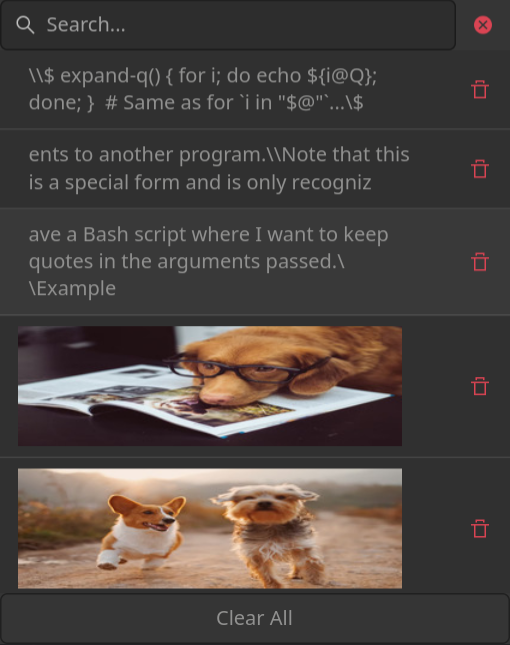

# Kaprica



> A Clipboard Manager for Wayland
## What does it do?
* Tracks all clipboard changes to a history database
* Continues to serve clipboard data even after the application that copied it has closed
* Allows you to search through the history with either a GUI `kapg` or a command line interface `kapc`
* Supports images, text, and all other custom data types
* Reimplements wl-clipboard functionality via `kapc`
## Running
### Daemon
The preferred way to run the Kaprica daemon is as a systemd user service:
```
systemctl --user enable --now kaprica
```
Alternatively, you can run it manually from the terminal:
```
kapd &
```
or by starting it from sway:
```
exec kapd
```
Once the daemon is running your clipboard history will be saved to `~/.local/share/kaprica/history.db`.
### GUI
To run the GUI, simply run `kapg`. Its recommended to bind it to a key in your window manager or desktop environment.


https://github.com/ArtsyMacaw/kaprica/assets/30781379/7460f4b6-9d3a-44e8-84f6-8bb2b7e8119c


### Command Line Interface
To run the command line interface, use `kapc`:

**List all entries in the clipboard history**
```
kapc search
```
**Paste the most recent entry**
```
kapc search --list --id --limit 1 | kapc paste --id
```
**Copy an entry in the history that matches a search term**
```
kapc search --list --id --limit 1 foobar | kapc copy --id
```
**Delete an entry in the history that matches a search term**
```
kapc delete foobar
```
### Picker Examples

<details>

<summary>fzf</summary>

`kapc search -L | fzf -d $'\t' --with-nth 2 | kapc copy -i`

</details>

<details>

<summary>wofi</summary>

`kapc search -Ls | wofi -S dmenu | kapc copy -r`

</details>

<details>

<summary>tofi</summary>

`kapc search -Ls | rofi -dmenu | kapc copy -r`

</details>

## Compositor Support
Kaprica uses the `wlr-data-control` protocol to interact with the compositor. This protocol is supported by the following compositors:
* wlroots-based compositors (sway, wayfire, etc.)
* Kwin (Plasma / KDE)

It will thus not work with compositors that do not support this protocol, such as Mutter (GNOME) or Weston.
## Installation
### Arch Linux
Install the package from the AUR:
```
yay -S kaprica
```
### Building from source
Install dependencies:
* meson \*
* wayland-protocols \*
* scdoc (optional: man pages) \*
* systemd (optional: service file)
* sqlite3
* wayland
* MagickWand
* inih
* xxhash
* gtk4
* libmagic

_\* Compile time dependencies_

Run the following commands:
```
git clone https://github.com/ArtsyMacaw/kaprica.git
cd kaprica
meson setup build
meson compile -C build
sudo meson install -C build
```
